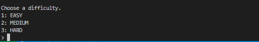
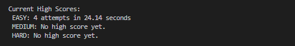
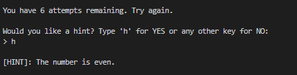
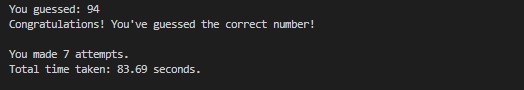

# 🔢 Number Guessing Game

[](https://www.python.org/downloads/)
[](https://opensource.org/licenses/MIT)

A robust CLI Number Guessing Game built with Python. Features dynamic difficulty levels, a smart hint system, and persistent high scores saved with JSON.

___

## 🚀 Features

### 3 Difficulty Levels: 
Choose between Easy, Medium, and Hard, each with a different number of allowed attempts.



### Persistent High Scores: 
Your best performances are saved to a `high_scores.json` file. Records are tracked by **number of attempts** and **time taken**.



### Smart Hint System: 

Stuck? Get a hint after your 3rd attempt that reveals if the number is even/odd or its divisibility.



### Time Tracking: 

Real-time calculation of how long it takes you to guess the number.




## 🛠️ Installation & Usage

### Prerequisites
- Python 3.12 or higher installed on your machine.

### Setup
1. **Clone the repo:**
    ```bash
    git clone [https://github.com/josequiceno2000/number-guessing-game.git](https://github.com/josequiceno2000/number-guessing-game.git)
   cd number-guessing-game
   ```

2. **Run the game:**
    ```bash
    python3 main.py
    ```

___

## 🎮 How to Play

1. Upon starting, you will see the current High Scores for all levels.

2. Select a difficulty:
    - Easy: 8 attempts
    - Medium: 6 attempts
    - Hard: 4 attempts

3. Input your guesses. The game will tell you if you are "Too High" or "Too Low."

4. If you reach 3 attempts, you'll be offered a Hint.

5. Beat the record to secure your spot in the high_scores.json!

___

## 📝 Credits & Feedback

This project was built as part of the [Roadmap.sh Number Guessing Game Project](https://roadmap.sh/projects/number-guessing-game).

Feedback is welcome! If you have ideas for new features (like a "Hardcore Mode" or global leaderboards), feel free to open an issue or submit a pull request.

___

*Created by Jose Quiceno*